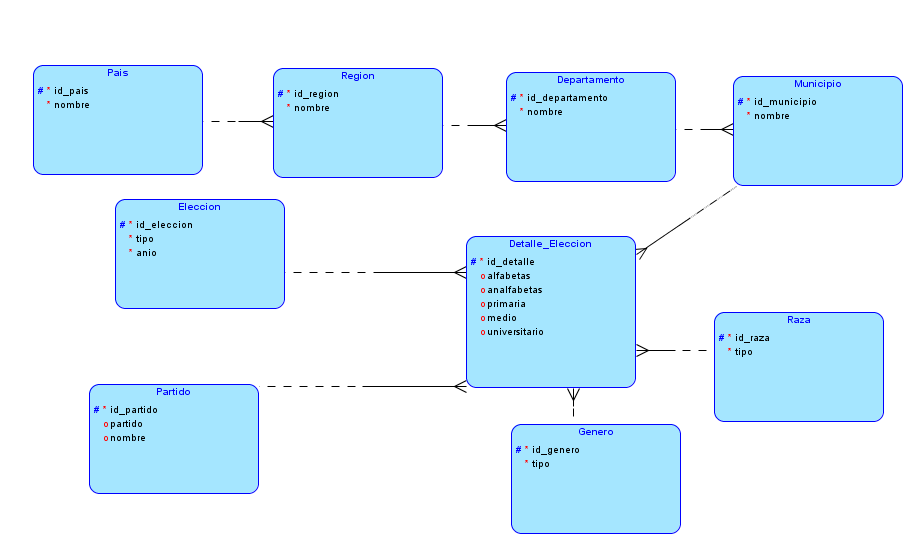
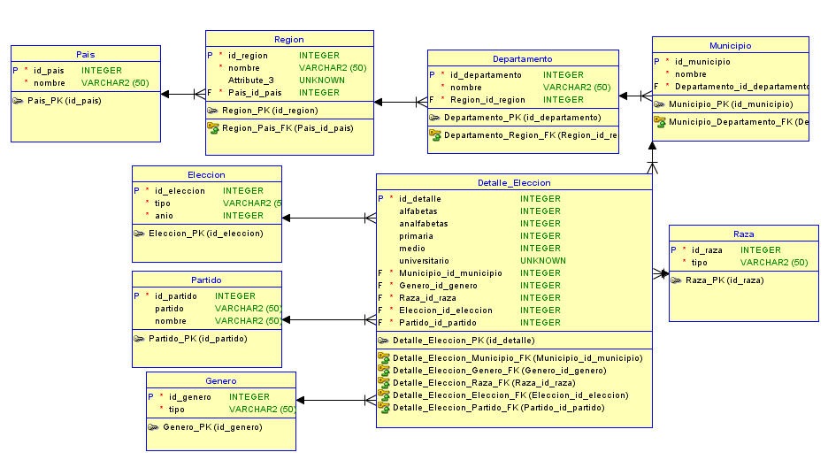

# Proyecto 2 Bases de Datos 1

### Informacion
| Nombre | Carné |
| ------ | ------ |
| Eduardo Saul Tun Aguilar | 201612124|
| Curso | Seccion |
| ------ | ------ |
| Base de Datos 1 | B|

## Solicitud
El Instituto Centroamericano Electoral (ICE) contrata sus servicios profesionales para realizar reingeniería al proceso de almacenamiento debido a que actualmente hay demasiada inconsistencia que puede provocarles serios problemas legales. El Instituto realiza el esfuerzo de exportar toda la información actual a un archivo Excel que usted tendrá a disposición para realizar el análisis correspondiente, deberá aplicar las formas de normalización que considere adecuada con el objetivo de eliminar la redundancia y crear una nueva plataforma escalable. 

## Documentacion 
El ICE solicita que realice un documento de análisis que le permita determinar el alcance de la nueva plataforma. El documento deberá tener como mínimo una descripción de las reglas de normalización aplicadas al archivo de Excel fuente, modelo entidad relación explicativo que permita visualizar de mejor manera la nueva estructura y de cómo se almacenará la información

## Modelo logico
  

## Modelo Relacional
  
